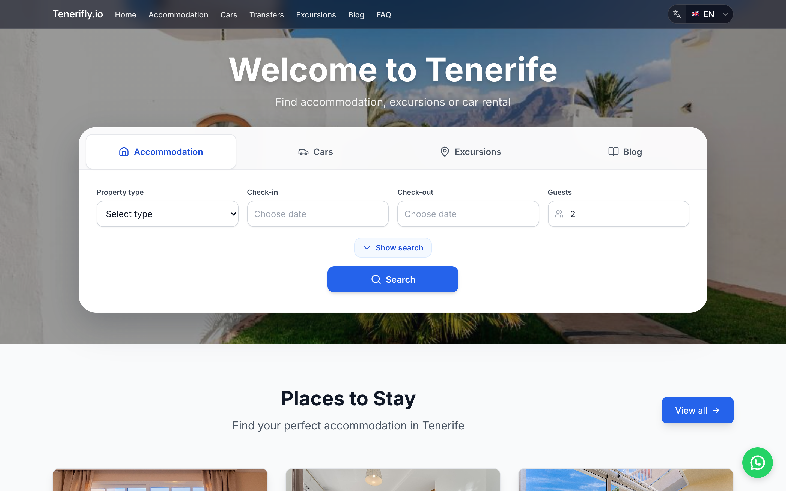

# Tenerifly.io

**Your guide to Tenerife** — apartments and villas, car hire, tours and excursions, and travel tips for the Canary Islands.

<p align="center">
  <a href="https://tenerifly.io" title="Open Tenerifly.io">
    
  </a>
</p>

<p align="center">
  <strong>Plan your trip in one place.</strong>
</p>

---

## Get Tenerifly

| Platform | Action |
|----------|--------|
| **Web** | [**Visit tenerifly.io**](https://tenerifly.io) — browse apartments, cars, tours & blog in your language |
| **WhatsApp** | [**Message us**](https://wa.me/34613211069) — quick questions and booking help |
| **X (Twitter)** | [**@tenerifly**](https://twitter.com/tenerifly) — updates and tips |

### Mobile apps

<p align="left">
  <a href="https://apps.apple.com/search?term=Tenerifly" title="Find Tenerifly on the App Store">
    
  </a>
  &nbsp;&nbsp;
  <a href="https://play.google.com/store/search?q=Tenerifly&c=apps" title="Find Tenerifly on Google Play">
    
  </a>
</p>

> When native apps are published, replace the links above with your direct App Store and Google Play listing URLs.

---

## For developers

This repository is the [Next.js](https://nextjs.org) frontend for **Tenerifly.io** (Node **20.18.1**).

### Getting started

```bash
npm install
npm run dev
```

Open [http://127.0.0.1:3000](http://127.0.0.1:3000). The app runs `fetch-translations` before dev/build; ensure Strapi and env vars are configured for full data.

### Scripts

| Command | Description |
|---------|-------------|
| `npm run dev` | Dev server with translation fetch |
| `npm run build` | Production build |
| `npm run start` | Run production server |
| `npm run lint` | ESLint |

### Learn more

- [Next.js documentation](https://nextjs.org/docs)
- Deployment: [Next.js deploying](https://nextjs.org/docs/app/building-your-application/deploying) (e.g. [Vercel](https://vercel.com/new))
